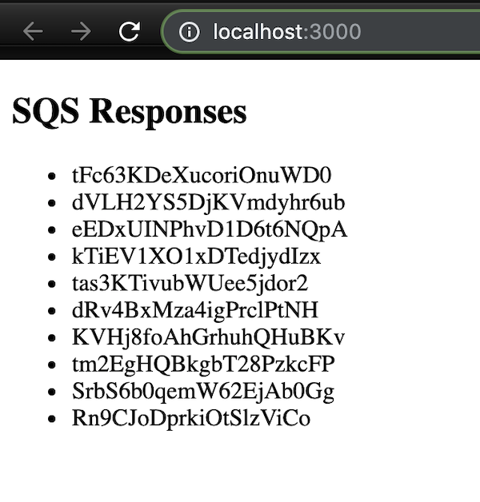

# SQS Message Queue

### Links
* [Logger](./logger/src/app.js)
* [App](./sqs/src/main/java/sqs/App.java)
* [Send](./sqs/src/main/java/sqs/Send.java)
* [Receive](./sqs/src/main/java/sqs/Receive.java)

### Run Instructions
* To start the front end:
  * `npm start` on the logger_QueueA application.
  * `npm start` on the logger_QueueB application.
  * `npm start` on the logger_QueueC application.
* To start the back end:
  * `./gradlew run --arge="{QUEUE_CHOICE}"` while in the sqs sub package.
    * `1` == QueueA
    * `2` == QueueB
    * `3` == QueueC

### Test Image

### Collaboration / Resources
* @Bombibear
* Sapana Poudel
* Nhu Trinh
* Joachen Busch
* Brandon Hurrington
* Renee Messick
* Travis Cox
* Jack Kinne
* Marisha Hoza
* Chris Coulon
* Matt Stuhring
* Melfi Perez
* Padmapriva Ganapathi
* [AWS SQS Docs](https://docs.aws.amazon.com/sdk-for-java/v1/developer-guide/examples-sqs-message-queues.html)
* [AWS SQS Example Code](https://github.com/awsdocs/aws-doc-sdk-examples/blob/master/java/example_code/sqs/src/main/java/aws/example/sqs/UsingQueues.java)
