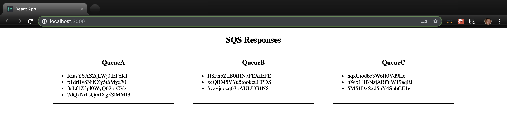
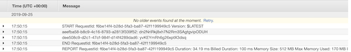

# SQS Message Queue

### Links to the code:
* React frontend:
  * [Logger Queue A](./logger_QueueA/src/app.js)
  * [Logger Queue B](./logger_QueueB/src/app.js)
  * [Logger Queue C](./logger_QueueC/src/app.js)
* Java backend:
  * [App](./sqs/src/main/java/sqs/App.java)
  * [Publish](./sqs/src/main/java/sqs/Publish.java) class takes in a command line argument with the amount of messages to be added. This class will randomly choose a Queue to add the messages to and then publish the message to that Queue.
  * [Receive](./sqs/src/main/java/sqs/Receive.java) is a lambda function which receives the messages from the SQS queues and logs them in cloud watch.

### Run Instructions
* To enable the front end:
  * First: use the terminal to `cd` into `sqs/logger_Queue{Letter}`.
  * Second: `touch .env` into each of the logger directories, to enable AWS access, and add your AWS keys to the variables:
    * `REACT_APP_AWS_ACCESS_KEY_ID={ACCESS_KEY}`
    * `REACT_APP_AWS_SECRET_ACCESS_KEY={SECRET_KEY}`
  * Third: while in the logger directory, perform a `npm start` for the logger Queue to engage the front end interface.
* To start the back end:
  * First: use the terminal to `cd` into `sqs/sqs`.
  * Second: run the terminal command `./gradlew run --args="{NUMBER_MESSAGES_TO_SEND}"`

### Testing Images
**React Front Visual of Messages**

**SQS Queues**
* SQS Logs Pre Lambda Pull

* SQS Logs Post Lambda Pull

**Cloudwatch message log for pulled messages**
* Cloudwatch Metrics

* Cloudwatch Log Overview

* Cloudwatch Log Internal Views

### Collaboration / Resources
* @Bombibear
* Sapana Poudel
* Nhu Trinh
* Joachen Busch
* Brandon Hurrington
* Renee Messick
* Travis Cox
* Jack Kinne
* Marisha Hoza
* Chris Coulon
* Matt Stuhring
* Melfi Perez
* Padmapriva Ganapathi
* [SQS Receive Event Message](https://docs.aws.amazon.com/lambda/latest/dg/with-sqs-create-package.html)
* [AWS SQS Docs](https://docs.aws.amazon.com/sdk-for-java/v1/developer-guide/examples-sqs-message-queues.html)
* [AWS SQS Example Code](https://github.com/awsdocs/aws-doc-sdk-examples/blob/master/java/example_code/sqs/src/main/java/aws/example/sqs/UsingQueues.java)
* [Random String Generator](https://www.geeksforgeeks.org/generate-random-string-of-given-size-in-java/)
